# Python

## 环境搭建

### Python3

Python 官网：https://www.python.org/ 下载Python安装包

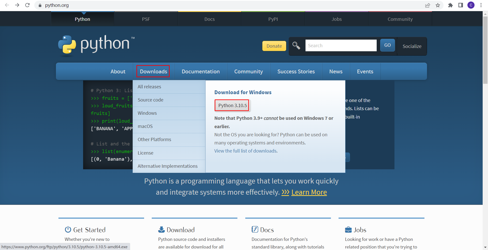

双击安装包运行安装程序

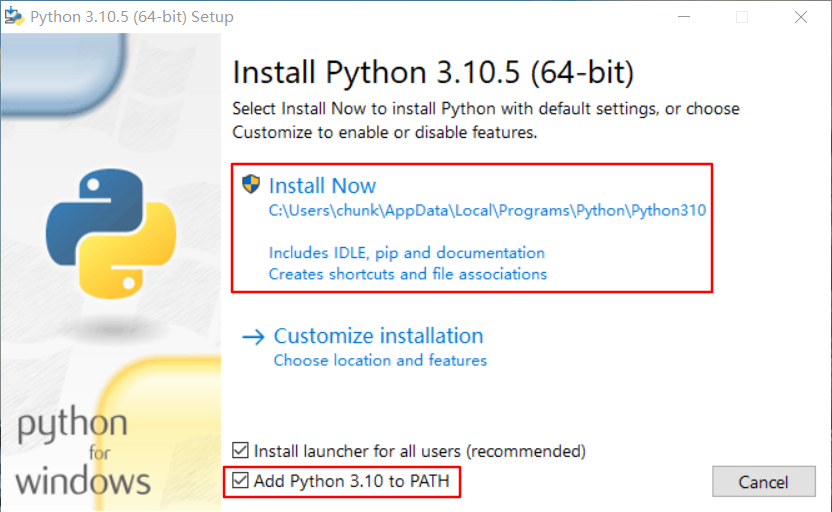

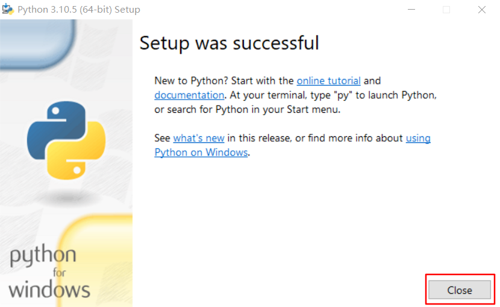

### 集成开发环境（IDE）: PyCharm

PyCharm 下载地址 : https://www.jetbrains.com/pycharm/download/ 下载PyCharm安装包

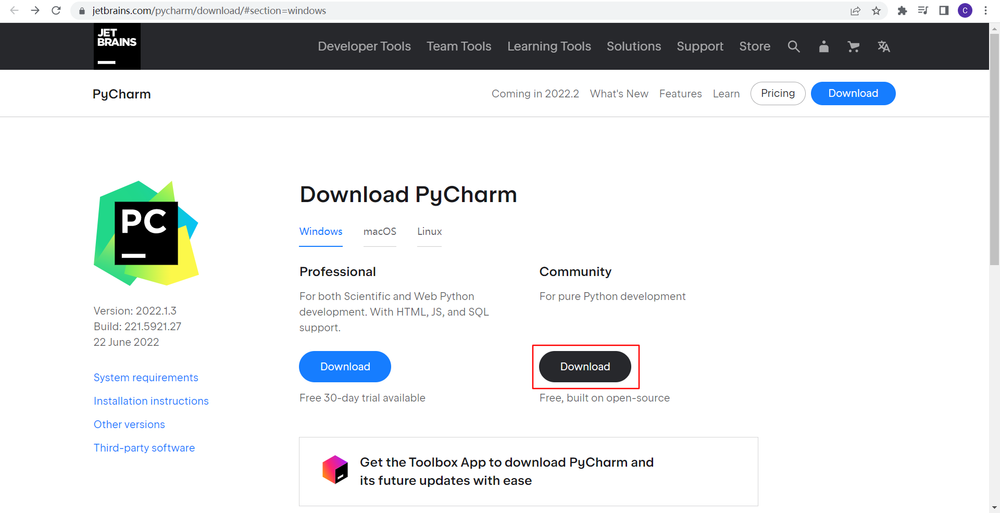

双击安装包运行安装程序

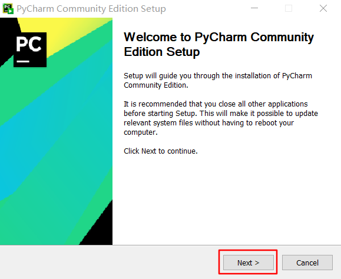

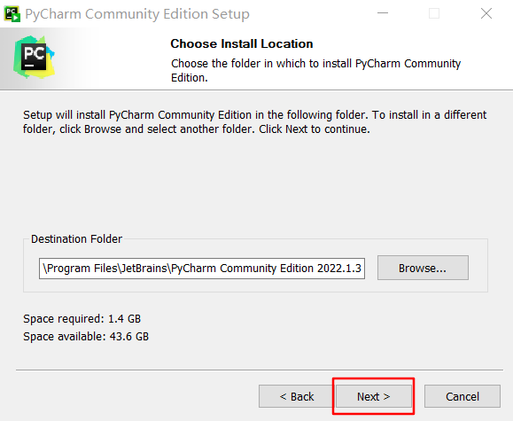

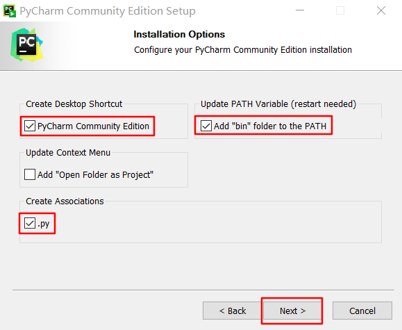

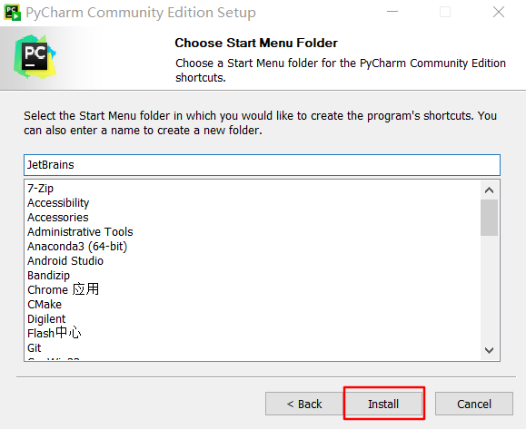

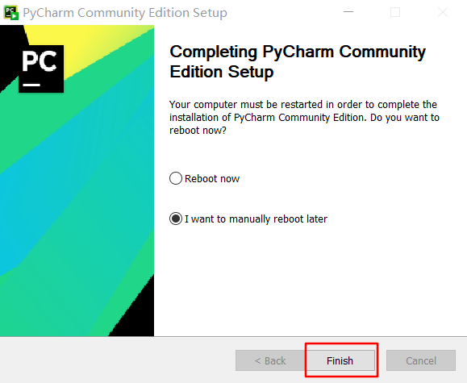

运行PyCharm程序

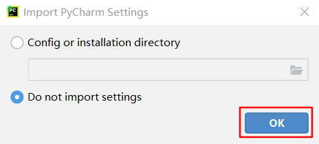

新建项目

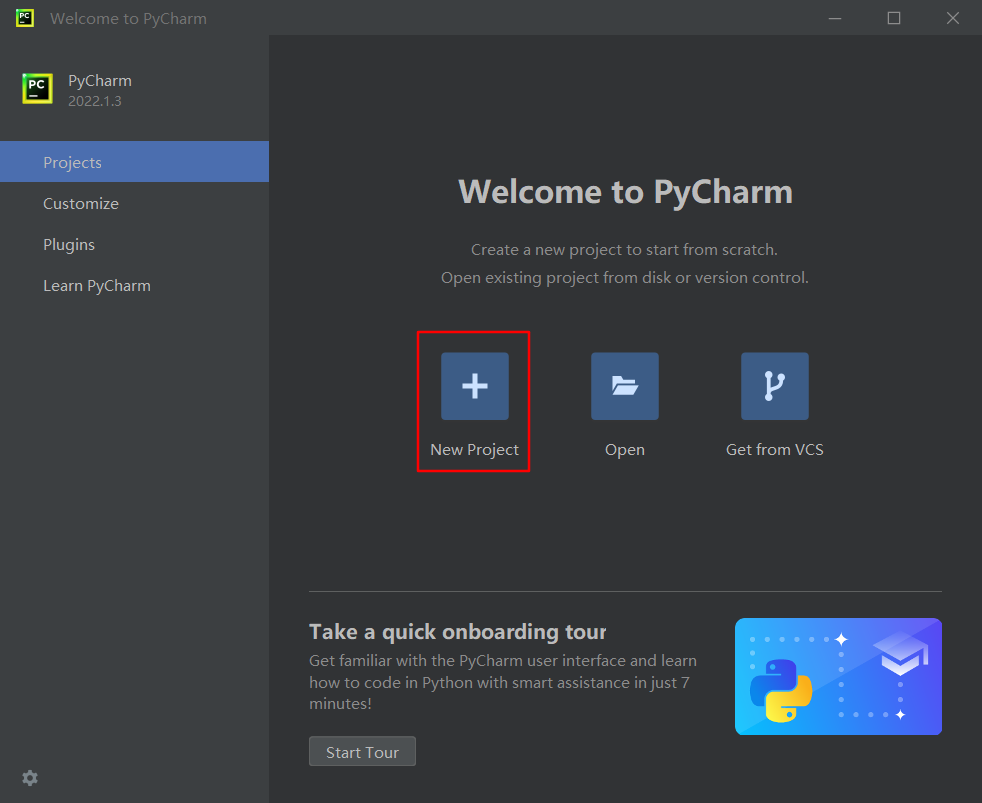

可以看到之前安装Python的目录

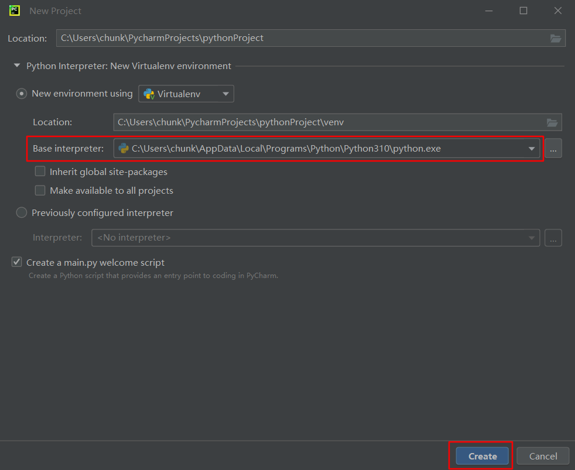

已经创建好的Hello Word项目

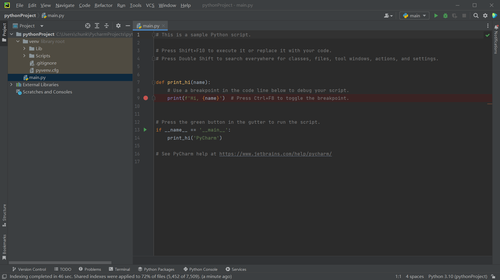

运行项目

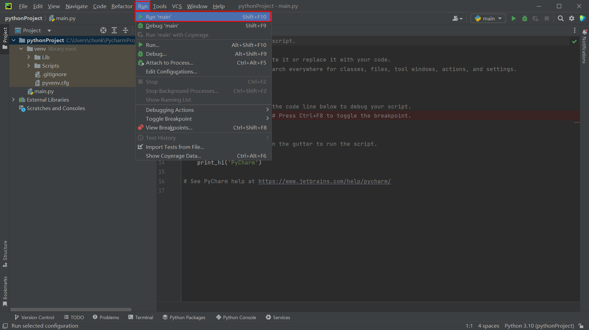

看到运行结果

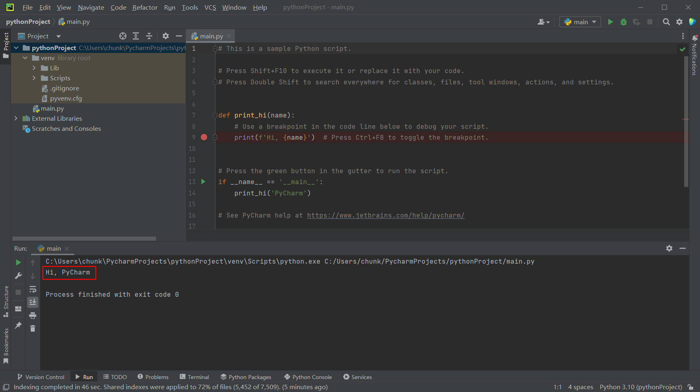

